# Hi!

I'm Wix, an artist, web designer and developer.

- Coding activity since April 12 2023 

- GitHub Stats 

## My Skills

)

)

## My Tools
)

)

)

### Join my [Discord Server](https://go.wixonic.fr/discord), or learn more on my [website](https://wixonic.fr)!
